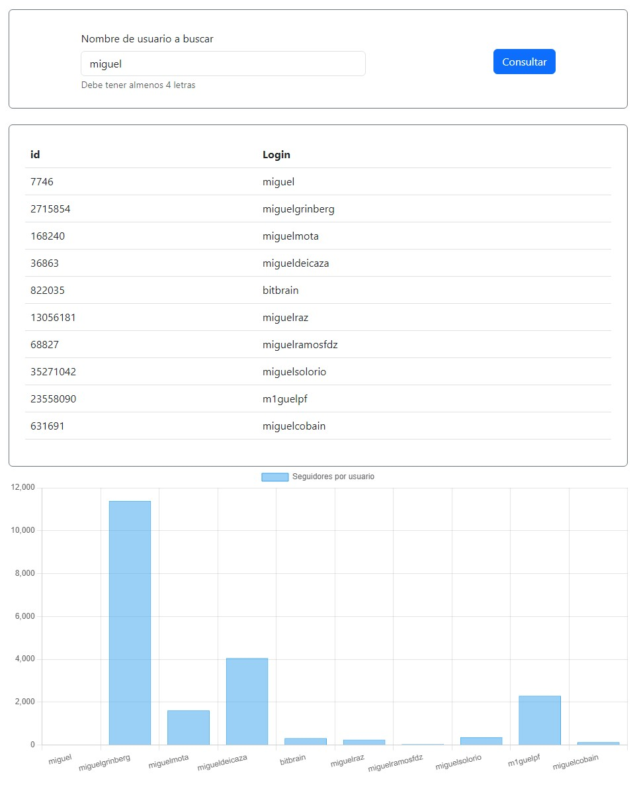
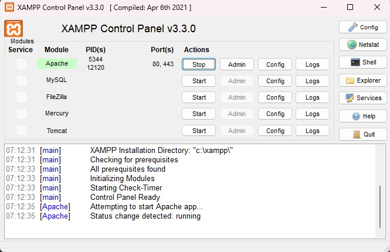
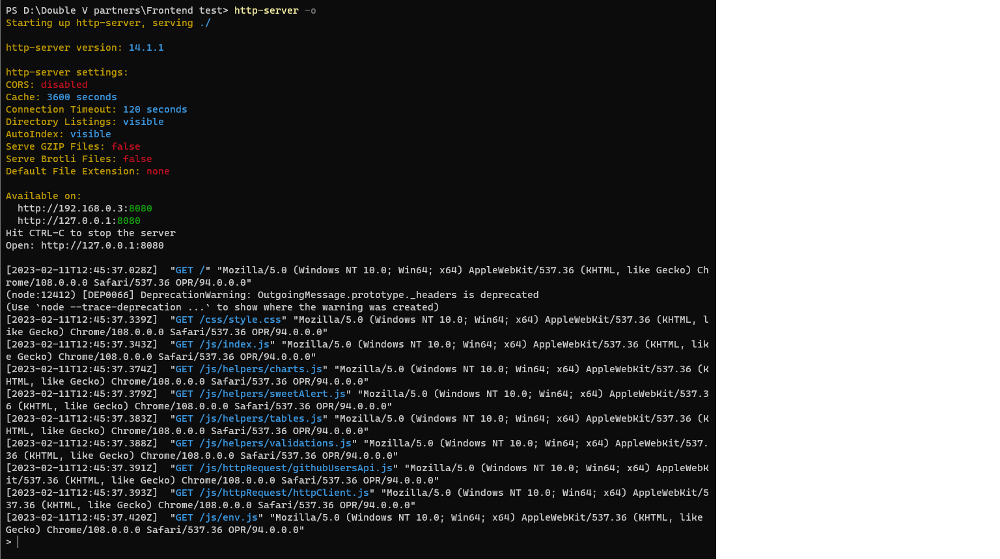

# __Double V Partners prueba tecnica__

Esta proyecto consiste en desarrollar dos pruebas tecnincas de frontend y backend para Double V Partners usando las siguientes tecnologías:

- HTML
- CSS
- JS
- PHP

# Fronted

Esta prueba consiste en hacer uso de la api de [Github](https://docs.github.com/en/rest/users/users?apiVersion=2022-11-28) para listar los usarios en una tabla y tambien mostrar un grafico de los seguidores de cada usuario consultado.<br>


## Intalación
---------------------
Para poder ejecutar el projecto se debe de usar un servidor local como [xampp](https://www.apachefriends.org/) o un paquete de nodejs como [http-serve](https://www.npmjs.com/package/http-server). Explicare como hacer la instalacion del projecto con los dos.

### Proceso XAMP
1. Clonar el projecto en el directorio __C:\xampp\htdocs__ con el comando
```
git clone https://github.com/orjuela45/Double-V-partners.git
```
2. Ejecutar Xamp<br>

3. Ir a la siguiente dirección web (Cambiar el puerto si se usa otro)
```
http://localhost:80/Frontend%20test/
```
con estos pasos ya se ejecutar la app 

### Proceso http-serve
1. Clonar el projecto en el directorio que se desee
```
git clone https://github.com/orjuela45/Double-V-partners.git
```
2. Abrir una terminal en el directorio Frontend test y ejecutar el siguiente comando
```
http-server -o
```

Se abrira una pestaña en el navegador predeterminado ejecutando la app

## Recomendaciones
---------------------
La api de github tiene un limite de peticiones gratuitas, por lo que se recomienda generar un token para tener una mayor cantidad de peticiones a la api. En este [enlace](https://docs.github.com/en/authentication/keeping-your-account-and-data-secure/creating-a-personal-access-token) podras ver como crear un token y para agregarlo al proyecto debes hacer lo siguiente.

1. Ir al archivo __Frontend test\js\env.example.js__ y cambiarlo por __env.example__

2. En la sección de github-token agregas el token que generaste (Nota: yo deje el que utilice para el desarrollo, puede que este en un futuro ya no sirva)

con esto ya tendras una mayor cantidad de peticiones a la api de github

# Backend

Esta prueba consiste en hacer un CRUD de tickets y que funcione como un servicio http RESTFUL. En esta prueba se utilizo php, mysql y docker<br>

## Intalación
---------------------
Para poder ejecutar el projecto se debe tener docker instalado en el ordenador. los pasos son los siguientes

### Proceso http-serve
1. Clonar el projecto en el directorio que se desee
```
git clone https://github.com/orjuela45/Double-V-partners.git
```
2. Abrir una terminal en el directorio Backend test y ejecutar el siguiente comando para levantar los contenedores
```
docker-compose up -d
```
3. Con esto ya se levantara el projecto en el enlace __127.0.0.1__

4. Verificar que la base de datos se haya ejecutado. Se puede ingresar a phpadmin en el enlace __127.0.0.1:8000__ y las credenciales son 
- usuario: root
- contraseña: p4rtn3rs

5. En caso de que la base de datos double-v-partners-database no tenga ninguna tabla, ejecutar en la base de datos el archivo __dump/tickets.sql__ el cual tiene la creación de la tabla y unos datos.

6. Ir a phpmyadmin en la sección importar

7. Seleccionar el archivo __dump/tickets.sql__ y luego pulsar el boton importar

Con esto ya se tendra todo listo para usar la app. 

## Endpoints
---------------------

Para hacer pruebas de los endpoints dejo la documentación que realice con postman de los endpoints desarrollados
[Documentación endpoints](https://documenter.getpostman.com/view/5695480/2s935uG13e)

# Notas
Espero que la prueba cumopla con los requisitos establecidos en la prueba y que sea del gusto de usted. Tambien me gustaria agregar, que me gusto trabajar en este test =D